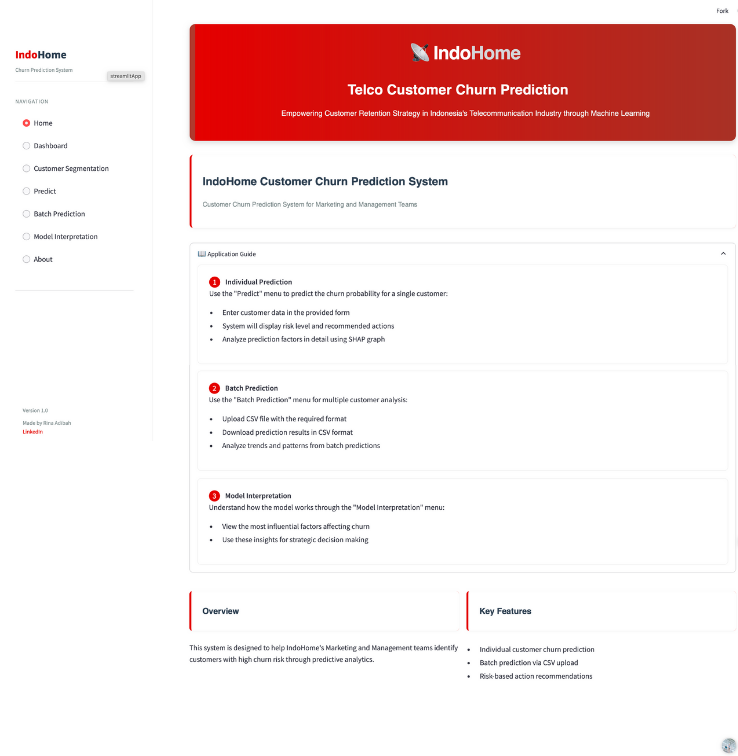
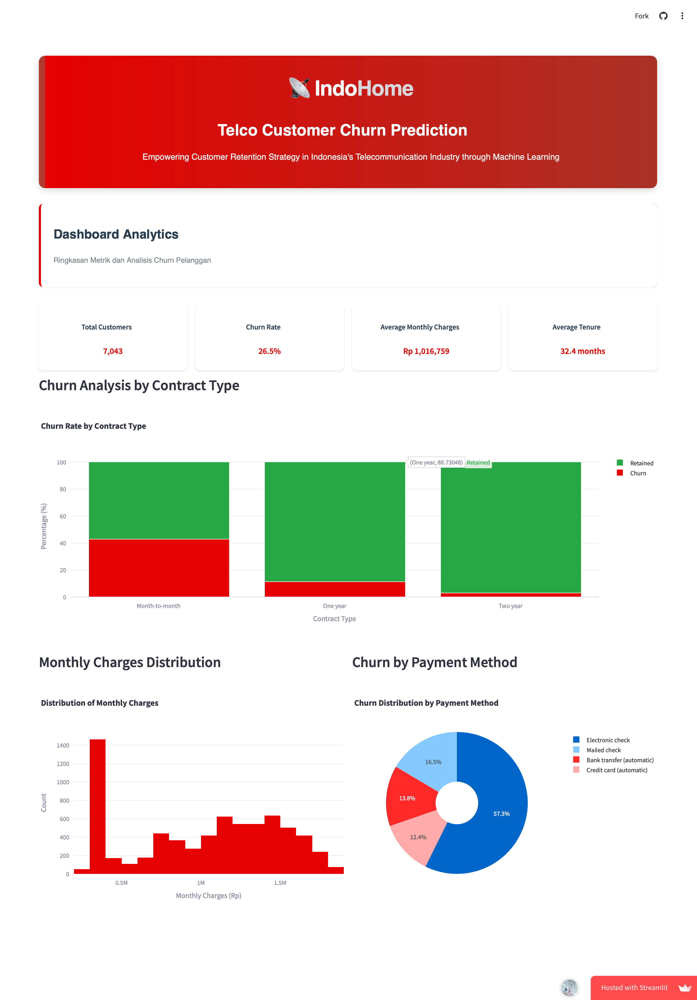
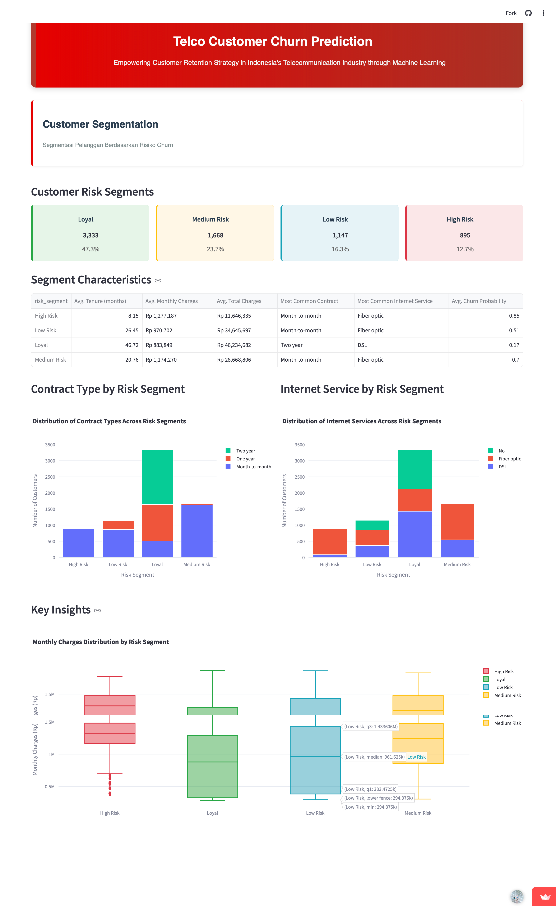
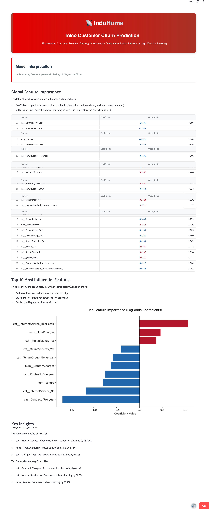
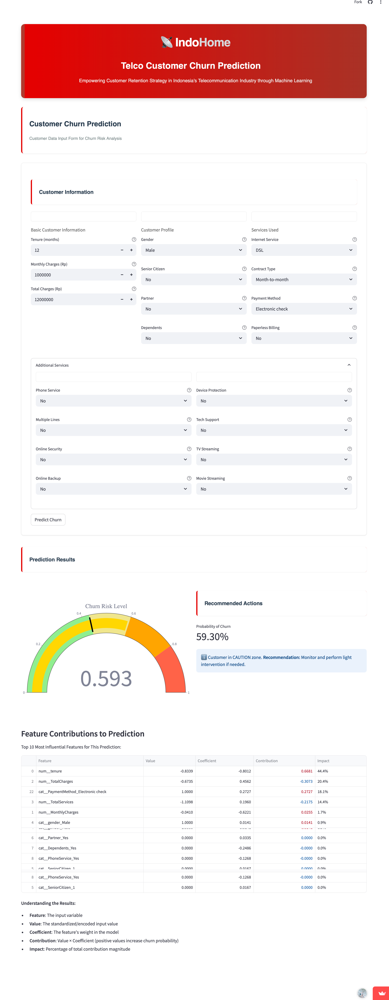
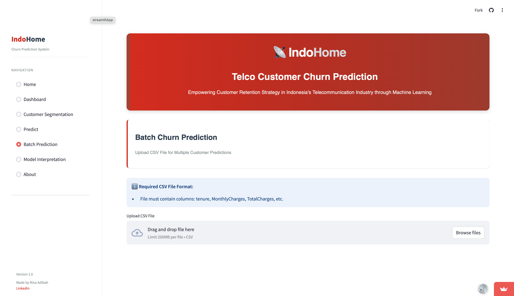
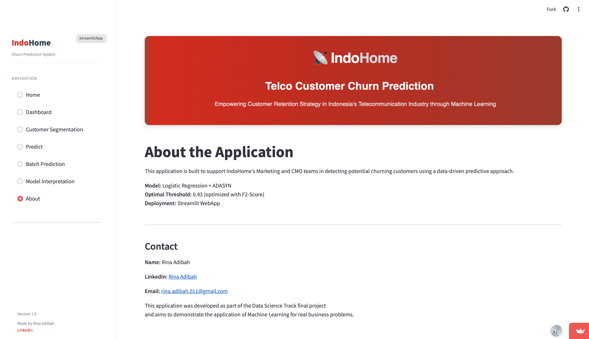
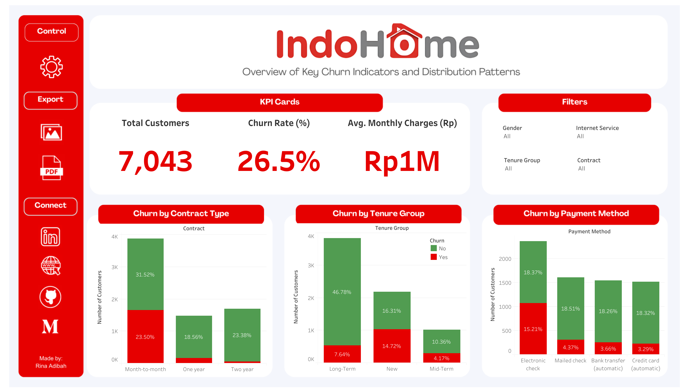
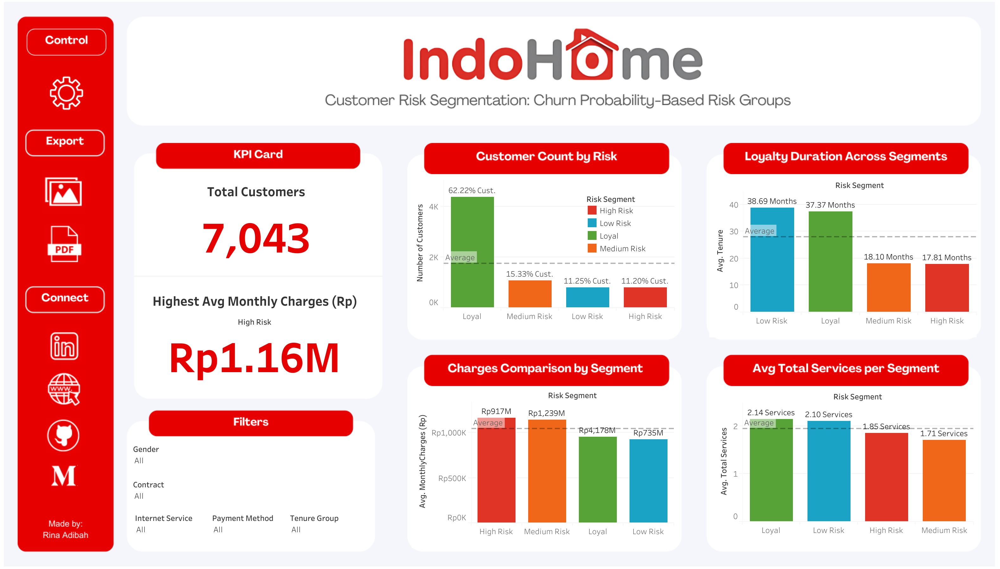
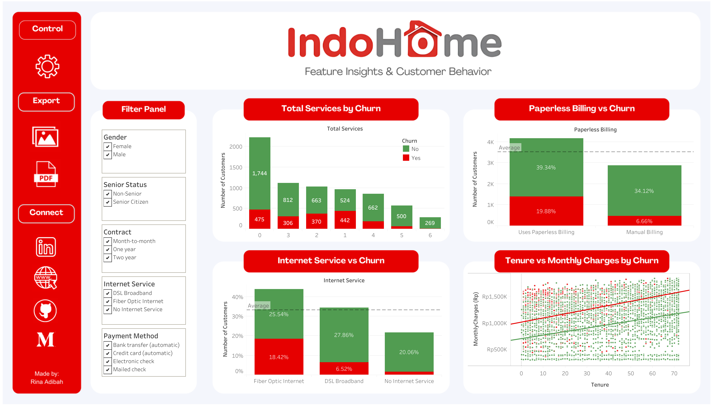

# Visual Showcase

## 🖼️ Application Screenshots & Dashboard Previews

This document provides a **visual tour** of the IndoHome Customer Churn Prediction System, showcasing both the interactive Streamlit application and comprehensive Tableau analytics dashboards.

---

## 🌐 Streamlit Web Application

### **Live Application Access**
**🔗 [IndoHome Churn Prediction App](https://indohome-telco-churn-app-jaqqq4c38dcepxzzitrbzc.streamlit.app)**

### **Application Features Overview**

#### **1. Home Page - Project Introduction**

**Key Features:**
- Project overview and business context
- Navigation to different modules
- Professional branding and design
- Clear value proposition presentation

---

#### **2. Analytics Dashboard - Model Insights**

**Key Features:**
- Model performance metrics visualization
- Feature importance analysis
- Business impact calculations
- Interactive charts and graphs

---

#### **3. Customer Risk Segmentation**

**Key Features:**
- Risk-based customer categorization
- Segmentation analytics
- Targeted intervention recommendations
- Visual risk distribution

---

#### **4. Model Prediction Interface**

**Key Features:**
- Individual customer churn prediction
- Real-time probability scoring
- Feature contribution analysis
- Interpretable model outputs

---

#### **5. Individual Prediction Form**

**Key Features:**
- User-friendly input form
- Customer data entry interface
- Instant prediction results
- Risk level classification

---

#### **6. Batch Prediction System**

**Key Features:**
- CSV file upload functionality
- Bulk customer processing
- Downloadable results
- Scalable prediction pipeline

---

#### **7. About & Documentation**

**Key Features:**
- Technical methodology explanation
- Model documentation
- Business impact analysis
- Contact information

---

## 📊 Tableau Business Intelligence Dashboards

### **Dashboard Access**
**🔗 [Tableau Public Dashboard](https://public.tableau.com/views/IndoHomeChurnAnalysisDashboard/Dashboard1-ExecutiveOverview?:language=en-GB&:sid=&:redirect=auth&:display_count=n&:origin=viz_share_link)**

### **Executive Analytics Suite**

#### **Dashboard 1: Executive Overview**

**Strategic Insights:**
- Overall churn rate trends and patterns
- Revenue impact analysis
- Customer lifecycle metrics
- Key performance indicators (KPIs)
- Executive-level decision support

**Business Value:**
- Quick overview of customer retention status
- Financial impact visualization
- Strategic planning support
- Performance monitoring capabilities

---

#### **Dashboard 2: Customer Risk Segmentation**

**Operational Insights:**
- High/Medium/Low risk customer categorization
- Segment-specific retention strategies
- Resource allocation optimization
- Campaign targeting recommendations

**Business Value:**
- Prioritized customer intervention
- Efficient marketing spend allocation
- Targeted retention campaign design
- ROI optimization for customer service

---

#### **Dashboard 3: Feature Insights & Analytics**

**Analytical Insights:**
- Feature importance rankings
- Churn driver identification
- Customer behavior pattern analysis
- Predictive factor visualization

**Business Value:**
- Data-driven product development
- Service improvement priorities
- Customer experience optimization
- Strategic business intelligence

---

## 🎯 User Experience Journey

### **End-to-End Workflow**

1. **📊 Strategic Analysis** → Tableau Dashboards for executive insights
2. **🎯 Individual Assessment** → Streamlit app for single customer prediction
3. **📈 Bulk Processing** → Batch prediction for large customer datasets
4. **🔍 Deep Dive** → Feature analysis for understanding churn drivers
5. **📋 Action Planning** → Risk segmentation for targeted interventions

### **Multi-Stakeholder Benefits**

#### **For Executives**
- **Strategic Dashboards**: High-level business intelligence
- **ROI Visualization**: Clear financial impact assessment
- **Performance Monitoring**: Real-time business metrics

#### **For Marketing Teams**
- **Risk Segmentation**: Targeted campaign development
- **Customer Insights**: Behavior-driven marketing strategies
- **Campaign Optimization**: Data-driven resource allocation

#### **For Customer Service**
- **Individual Predictions**: Proactive customer engagement
- **Risk Scoring**: Priority-based customer service
- **Intervention Timing**: Optimal outreach planning

#### **For Data Teams**
- **Model Interpretability**: Understanding prediction drivers
- **Performance Metrics**: Continuous model monitoring
- **Technical Documentation**: Implementation guidelines

---

## 🚀 Technical Capabilities Demonstrated

### **Machine Learning Implementation**
- **Production-Ready Model**: Logistic Regression + ADASYN
- **Real-Time Predictions**: Sub-second response times
- **Scalable Architecture**: Handles individual and batch processing
- **Model Interpretability**: Clear feature contribution analysis

### **Full-Stack Development**
- **Frontend**: Modern Streamlit interface
- **Backend**: Python-based ML pipeline
- **Data Visualization**: Interactive charts and dashboards
- **Business Intelligence**: Professional Tableau analytics

### **Professional Deployment**
- **Cloud Hosting**: Streamlit Cloud deployment
- **Version Control**: Git-based development workflow
- **Documentation**: Comprehensive technical and business docs
- **Portfolio Ready**: Industry-standard presentation

---

## 📈 Portfolio Impact

This visual showcase demonstrates:

✅ **End-to-End ML Project**: From analysis to deployment  
✅ **Business Acumen**: ROI-focused solution development  
✅ **Technical Excellence**: Production-ready implementation  
✅ **Visual Communication**: Professional presentation skills  
✅ **Multi-Platform Integration**: Streamlit + Tableau ecosystem  
✅ **User Experience Design**: Intuitive interface development  
✅ **Stakeholder Alignment**: Multi-audience solution design  

---

## 🎊 Recognition & Impact

**This project showcases professional data science capabilities through:**
- **Live Production Application**: Demonstrating deployment expertise
- **Executive-Level Analytics**: Business intelligence and strategic insights
- **Technical Documentation**: Industry-standard practices
- **Visual Storytelling**: Compelling presentation of complex data
- **End-User Focus**: Practical, usable business solutions

**Perfect for demonstrating to:**
- 🎯 **Recruiters**: Technical and business capabilities
- 💼 **Hiring Managers**: Production-ready project experience
- 👥 **Collaborators**: Professional development standards
- 🏢 **Stakeholders**: Business value and ROI focus 